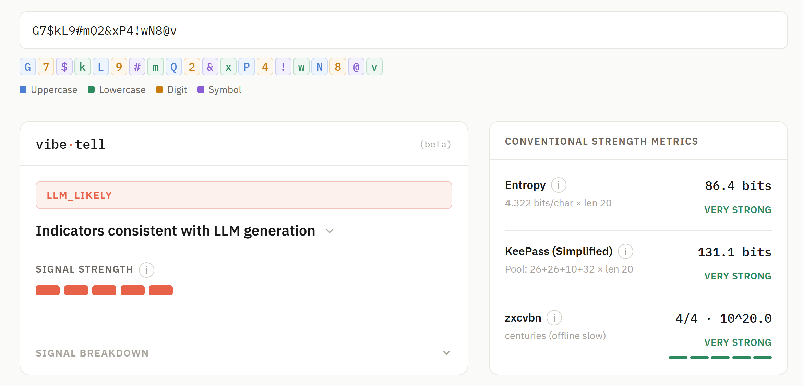

# vibetell

   

Engine that attempts to detect LLM-generated credentials. 

[Try out the web-demo & read the FAQ.](https://mabutaha.github.io/vibetell/)

[](https://mabutaha.github.io/vibetell/)

<p align="center"><i>vibetell is in beta. Full engine documentation and the accompanying paper explaining SCT are forthcoming.</i></p>

---

## Quick start

```bash
git clone https://github.com/mabutaha/vibetell.git
cd vibetell
python3 vibetell_cli.py --unknown credentials.txt
```

Or pipe directly:

```bash
echo 'G7$kL9#mQ2&xP4!w' | python3 vibetell_cli.py
```

---

## Files

**`vibetell.py`** — the engine. Pure library, no I/O, no dependencies. Import directly:

```python
import vibetell

result = vibetell.analyze("G7$kL9#mQ2&xP4!w")
print(result.verdict)           # LLM_LIKELY | LLM_POSSIBLE | INCONCLUSIVE
print(result.signal_strength)   # 0.0–0.99, not a probability
print(result.signals)           # detection path, e.g. "SCT+LLR"
print(result.features.sc)       # SCT rate
print(result.features.llr)      # LLR score
```

**`vibetell_cli.py`** — the CLI tool. Imports the engine, handles file I/O and reporting. Both files must be in the same directory.

## CLI reference

| Flag | Description |
|------|-------------|
| `--llm <files>` | Label as LLM-generated. Reports recall and false negative count. |
| `--csprng <files>` | Label as CSPRNG. Reports false positive rate. |
| `--unknown <files>` | No ground truth. Reports detection rate only. |
| `--misses` | Print only missed passwords (FN for LLM, FP for CSPRNG). |
| `--verbose` | Print every password with its verdict. |
| `--signals` | Full signal-level detail per password (implies `--verbose`). |
| `--no-strip` | Disable prefix stripping; analyze the full credential as-is. |

Input: `.txt` (one per line), `.csv` (must have a `password` column), or stdin.

```bash
# Evaluate recall against a labeled LLM corpus
python3 vibetell_cli.py --llm llm_passwords.csv

# Combined evaluation: precision, recall, F1, FPR
python3 vibetell_cli.py --llm corpus.csv --csprng random.txt

# Full signal breakdown per credential
python3 vibetell_cli.py --unknown secrets.txt --signals
```

---

## Performance

| Dataset | n | LIKELY + POSSIBLE | LIKELY only |
|---------|---|-------------------|-------------|
| Training (3 models) | 5,566 | 99.4% | 93.5% |
| Holdout (18 models, unseen) | 752 | 97.5% | 86.8% |

FPR: At LLM_LIKELY: less than 1 in 100,000 flagged. At LLM_POSSIBLE: about 9 in 1,000 (at length = 16).

## Limitations

- Credentials shorter than 12 characters are skipped. The engine is more reliable around after length 16.
- Gibberish only; passwords with dictionary words or hybrid patterns (e.g. `Horse#Battery9!`) are out of scope.
- Detection reliability varies by credential type. This will improve with future versions.
